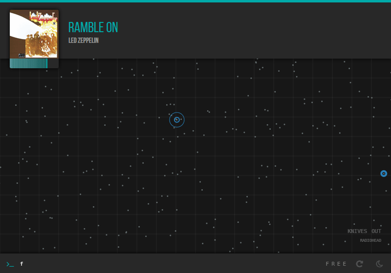

> I am ripping this apart [into](https://github.com/lepisma/bbq) [pieces](https://github.com/lepisma/jove). Once I finish incorporating streaming media sources in it, hopefully all the moving pieces will fall again together. Also, I badly want to replan the UI.

<kbd>under development</kbd>

*Exploratory music player*

Blackbird lets you explore your [beets](http://beets.io) library in acoustic feature space.



---

#### Setting Up

- Initialize a [beets](http://beets.io) library
- Install blackbird
  
  ```shell
  npm install -g lepisma/blackbird
  ```
- Install python dependencies
  
  ```shell
  # Navigate to source (in local node installation directory, or clone this repo)
  cd ./utils
  pip install -r requirements.txt
  ```
- Run `blackbird-setup init` to initialize configuration files.
- You might need to rebuild `sqlite3`. See [here](http://electron.atom.io/docs/latest/tutorial/using-native-node-modules/).
- Compile sass with `npm run build` if changes are made.

- `beets` imports will automatically put songs in blackbird database. Following commands are added to `beets`.

  ```shell
  # Generate sequential features for given query
  beet features

  # Generate coordinates from the sequential features using specified method
  beet coords --type [mean, lstm]
  ```
- Start with `blackbird`

##### Music Features

MFCC coefficients of size (20, N) are generated when `beet features` is called. N depends on length of song, block_reduced (mean) using a block of size (1, 100).

When `beet coords` is called with `mean` option, a clipped mean vector of size 20 is used as representation of each song. With `lstm` option, a keras lstm encoder-decoder model is loaded and resulting middle vector is used as representation. Both cases use TSNE to reduce the 20 vector to 2 and provide coordinates for visualization. Lookout for training notebook and pre-trained models in `./utils`.

##### Commands

- `a` / `artist` → *Artist mode*

  View songs by artist of current song
  
- `am` / `album` → *Album mode*

  View songs from album of current song
  
- `s <term>` / `search <term>` → *Search mode*

  Filter using search query. `_space_` in query is intersection, `+` is union, `-` is except
  
- `f` / `free` → *Free mode*. View all items
- `sim` / `similar` → Sort in-mode according to similarity with current song
- `cap <n>` / `artistcap <n>` → Filter artists with less than `n` songs
- `n <n>` / `new <n>` → `n` recent imports
- `r` / `repeat` → Toggle repeat
- `slp <n>` / `sleep <n>` → Sleep after playing `n` songs. Set negative `n` for
  reset.
- `l` / `love` → Mark songs as loved in last.fm
- `lfm` / `lastfm` → Toggle last.fm integration
- `d` / `download` → Download music from youtube. First command opens youtube,
  second lets you check metadata for download. Needs
  [ffmpeg](https://www.ffmpeg.org/) for saving mp3s. 

##### Shortcuts

- <kbd>ctrl+alt+\<right\></kbd> → Next song
- <kbd>ctrl+alt+\<left\></kbd> → Previous song
- <kbd>ctrl+alt+\<space\></kbd> → Play/pause
- <kbd>ctrl+alt+\<down\></kbd> → Hide to tray
- <kbd>ctrl+alt+\<up\></kbd> → Pop to front
- <kbd>alt+x</kbd> → Enter command (while window active)
- <kbd>ctrl+w</kbd> → Exit

##### Others

There is an emacs package for reading lyrics of current song (`./utils/emacs/blackbird.el`).

##### Bugs / Issues

blackbird is under development and therefore has crappy code structure and documentation. Feature addition/removal (and occasional refactoring) keeps happening. Please file issues [here](https://github.com/lepisma/blackbird/issues).
