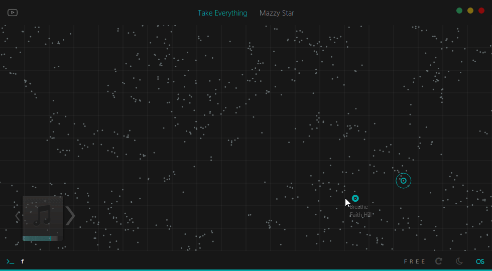

# blackbird

<kbd>under development</kbd>

*Exploratory music player*



---

#### Setting Up

1. Initialize a [beets](http://beets.io) library
2. Setup `config.yaml`
3. Install dependencies

  ```
  npm install
  pip install -r requirements.txt
  gem install sass
  ```
4. You might need to rebuild `sqlite3` and `zerorpc`. See [here](http://electron.atom.io/docs/latest/tutorial/using-native-node-modules/).
5. Compile sass `sass --update ./app/styles`
6. Run random scanner to generate coordinates for the library

  ```
  cd ./utils
  python randomscan.py
  ```
7. Run `npm start`

##### Downloading Music

- Run downloader process `python ./utils/downloader.py`
- Open Youtube frame (top left button)
- Navigate to music and enter `d`
- Confirm metadata and enter `d y` to save mp3 (needs `ffmpeg`)

##### Setting up Music Features

*TODO*

##### Commands

- `a` / `artist` → *Artist mode*. View songs by current [song] artist
- `am` / `album` → *Album mode*. View songs from current [song] album
- `s <term>` / `search <term>` → *Search mode*. View items with term in name/artist/album
- `f` / `free` → *Free mode*. View all items
- `sim` / `similar` → Sort in-mode according to similarity with current song
- `r` / `repeat` → Toggle repeat
- `slp <n>` / `sleep <n>` → Sleep after playing `n` songs
- `l` / `love` → Mark songs as loved in last.fm
- `d` / `download` → Download music from youtube

##### Shortcuts

- <kbd>ctrl+alt+\<right\></kbd> → Next song
- <kbd>ctrl+alt+\<left\></kbd> → Previous song
- <kbd>ctrl+alt+\<space\></kbd> → Play/pause
- <kbd>ctrl+alt+\<down\></kbd> → Hide to tray
- <kbd>ctrl+alt+\<up\></kbd> → Pop to front
- <kbd>alt+x</kbd> → Enter command (while window active)
